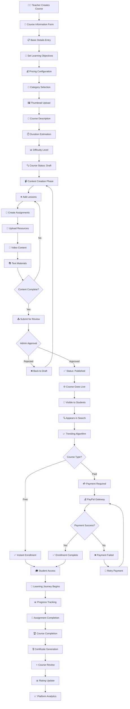
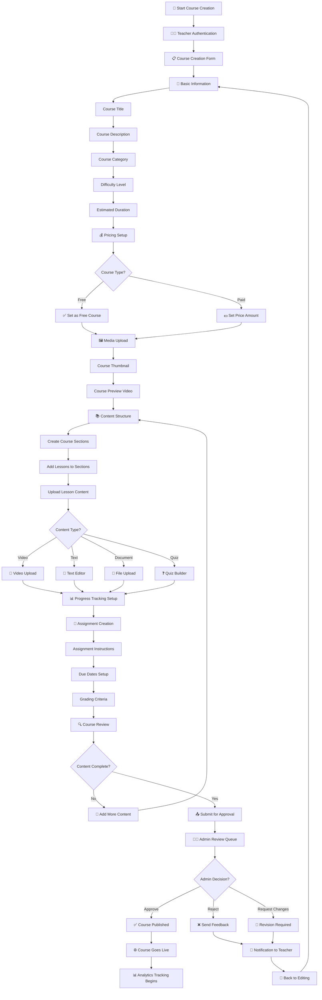
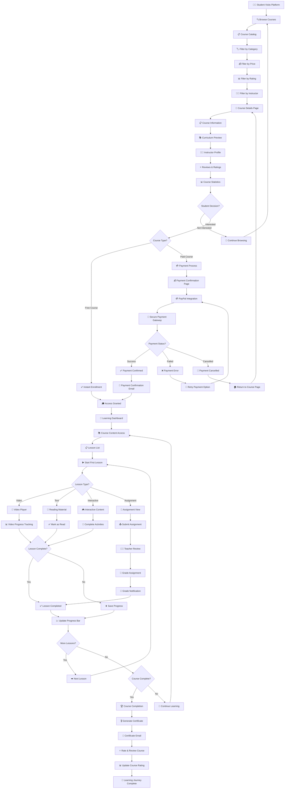
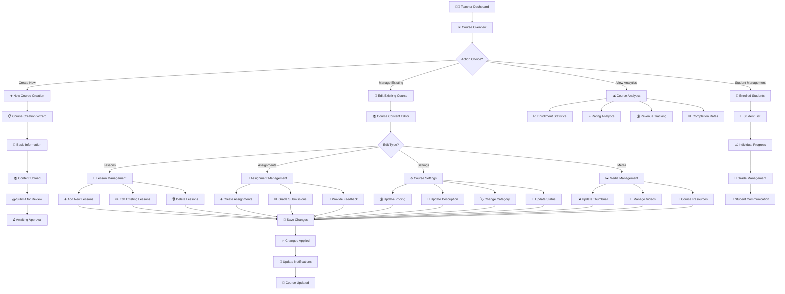
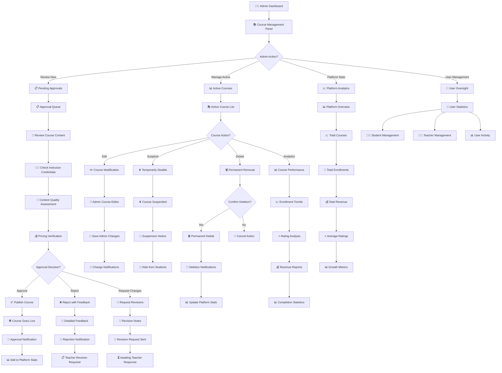
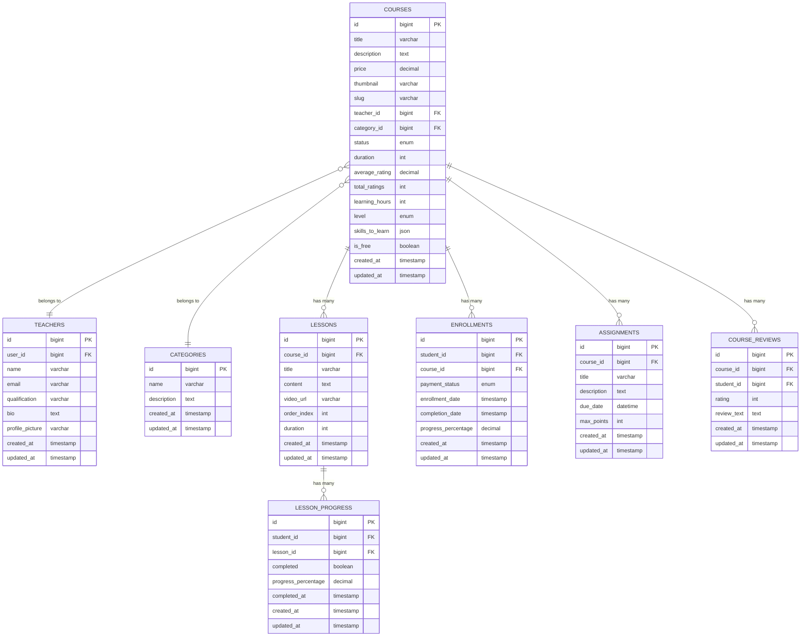
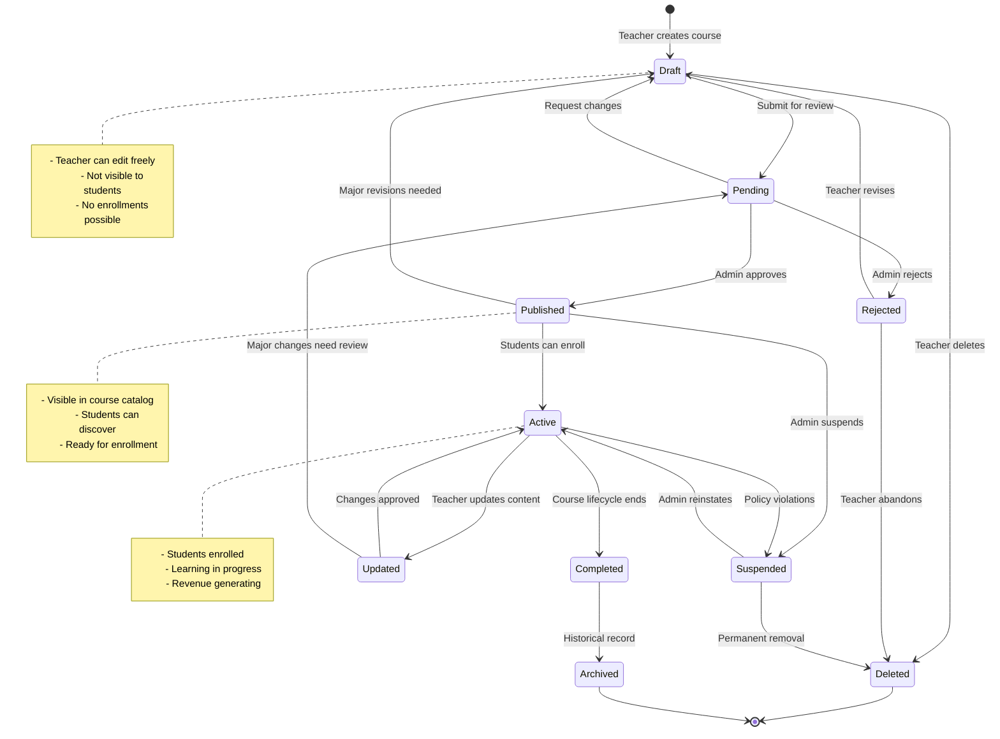
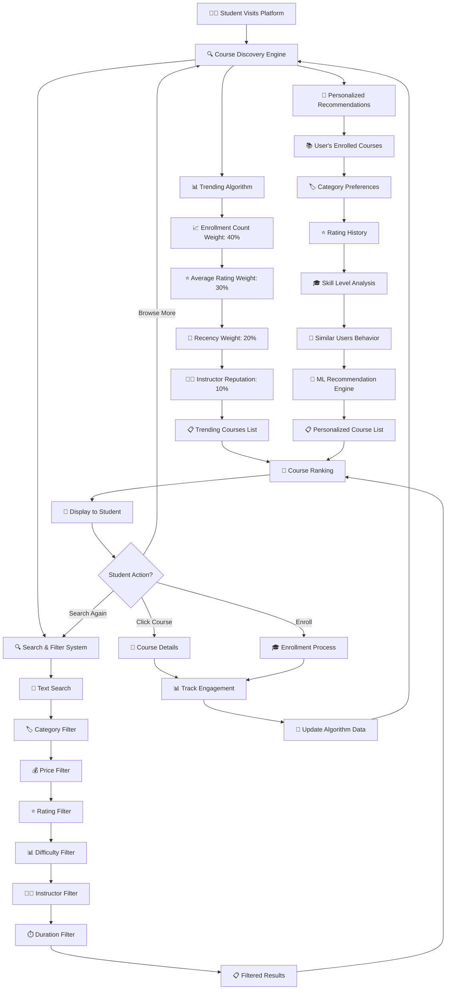

# 📚 LearnHub Course System - Comprehensive Flowchart

## 🎯 **Course Ecosystem Overview**

This document provides detailed flowcharts for all aspects of the course system in your LearnHub platform.

---

## 🔄 **1. Complete Course Lifecycle Flowchart**



---

## 🏗️ **2. Course Creation Process Flowchart**



---

## 🎓 **3. Student Course Enrollment & Learning Journey**



---

## 👨‍🏫 **4. Teacher Course Management Flowchart**



---

## 👨‍💼 **5. Admin Course Management Flowchart**



---

## 💳 **6. Course Payment Processing Flowchart**

```mermaid
graph TD
    A[👨‍🎓 Student Selects Paid Course] --> B[📖 Course Details Review]
    B --> C[💰 View Pricing Information]
    C --> D[🛒 Click "Purchase Course"]
    
    D --> E[💳 Payment Confirmation Page]
    E --> F[📋 Order Summary]
    F --> G[Course Title & Price]
    G --> H[💳 PayPal Payment Button]
    
    H --> I[🔄 Redirect to PayPal]
    I --> J[🔐 PayPal Authentication]
    J --> K[👤 Login to PayPal Account]
    K --> L[💳 Payment Method Selection]
    L --> M[💰 Payment Authorization]
    
    M --> N{Payment Status?}
    
    N -->|Success| O[✅ Payment Completed]
    N -->|Failed| P[❌ Payment Failed]
    N -->|Cancelled| Q[🚫 Payment Cancelled]
    N -->|Pending| R[⏳ Payment Processing]
    
    O --> S[📧 Payment Confirmation Email]
    S --> T[💾 Create Enrollment Record]
    T --> U[📊 Update Course Statistics]
    U --> V[🎓 Grant Course Access]
    V --> W[🏠 Redirect to Success Page]
    W --> X[📖 "Successfully Purchased" Message]
    X --> Y[🎓 "Start Learning" Button]
    Y --> Z[📚 Course Content Access]
    
    P --> AA[❌ Payment Error Display]
    AA --> BB[📝 Error Details]
    BB --> CC[🔄 Retry Payment Option]
    CC --> DD[🏠 Return to Course Page]
    DD --> E
    
    Q --> EE[ℹ️ Cancellation Message]
    EE --> FF[🏠 Return to Course Details]
    FF --> B
    
    R --> GG[⏳ Processing Notification]
    GG --> HH[🔄 Check Payment Status]
    HH --> II{Status Updated?}
    II -->|Yes| N
    II -->|No| JJ[⏱️ Wait and Retry]
    JJ --> HH
    
    %% Database Updates
    T --> KK[💾 Payment Records Table]
    T --> LL[💾 Enrollments Table]
    T --> MM[💾 User Activity Log]
    U --> NN[💾 Course Statistics Update]
    
    %% Analytics
    O --> OO[📊 Revenue Analytics]
    O --> PP[📈 Sales Tracking]
    O --> QQ[💰 Teacher Earnings]
```

---

## 📊 **7. Course Data Structure & Relationships**



---

## 🎯 **8. Course Status Lifecycle**



---

## 📈 **9. Course Discovery & Recommendation Algorithm**



---

## 🎓 **Course System Key Metrics**

### 📊 **Database Statistics**
- **Total Tables**: 8 core course-related tables
- **Primary Relationships**: 7 major relationships
- **Status Types**: 6 different course states
- **User Roles**: 3 course-related roles (Student, Teacher, Admin)

### 🎯 **Course Features**
- **Content Types**: Video, Text, Interactive, Assignments
- **Pricing Models**: Free and Paid courses
- **Progress Tracking**: Lesson-level and course-level progress
- **Quality Control**: Admin approval workflow
- **Payment Integration**: PayPal secure processing
- **Analytics**: Comprehensive tracking and reporting

### 📈 **Course Flow Statistics**
- **Creation Process**: 15+ steps from concept to publication
- **Student Journey**: 20+ touchpoints from discovery to completion
- **Payment Flow**: 10+ steps for secure transaction processing
- **Admin Management**: 12+ administrative actions available

---

**📚 This comprehensive course system supports the complete lifecycle of online education, from course creation to student certification, with robust payment processing, quality control, and analytics throughout the entire journey.**