# Online Course Platform - Complete System Flowchart

## 🎯 System Overview
**LearnHub Online Course Platform** - A comprehensive Laravel-based e-learning management system with PayPal payment integration.

---

## 📋 Table of Contents
1. [User Authentication Flow](#user-authentication-flow)
2. [Course Management Flow](#course-management-flow)
3. [Payment Processing Flow](#payment-processing-flow)
4. [Learning Progress Flow](#learning-progress-flow)
5. [Admin Management Flow](#admin-management-flow)
6. [Teacher Management Flow](#teacher-management-flow)
7. [Database Architecture](#database-architecture)
8. [System Components](#system-components)

---

## 🔐 User Authentication Flow

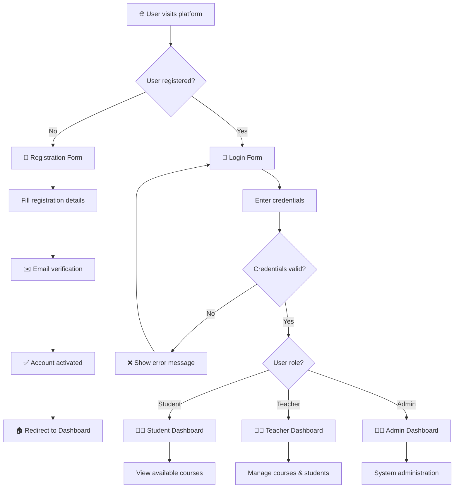

---

## 📚 Course Management Flow

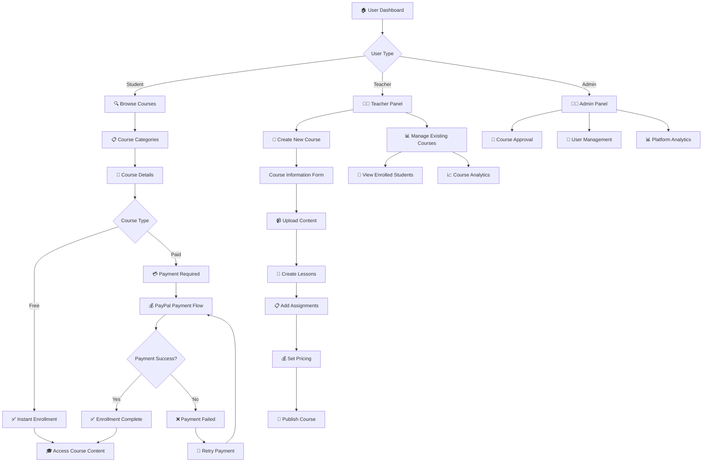

---

## 💳 Payment Processing Flow

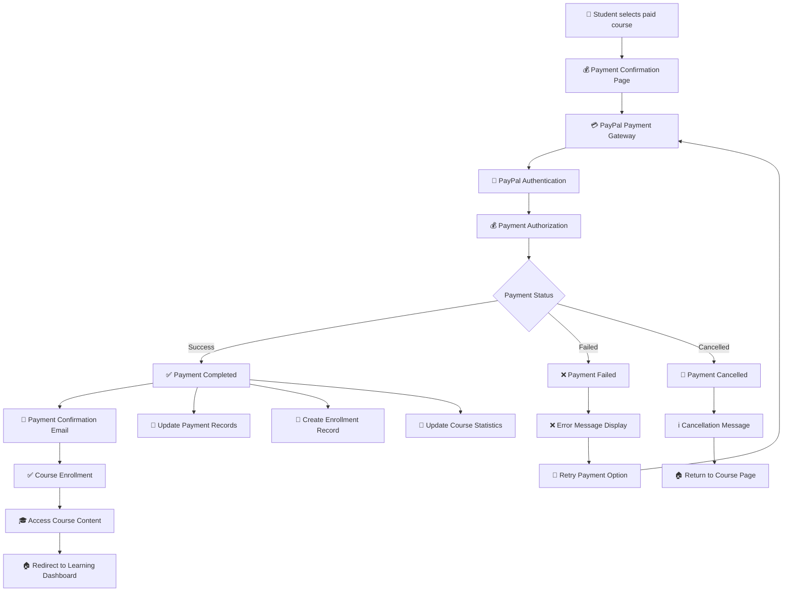

---

## 📖 Learning Progress Flow

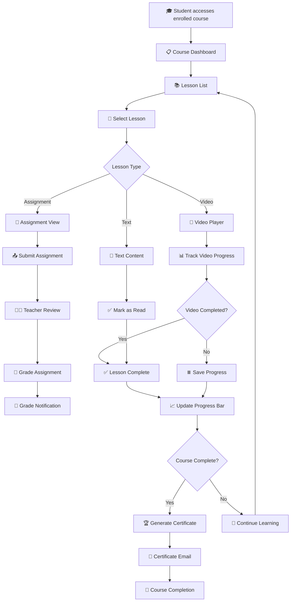

---

## 👨‍💼 Admin Management Flow

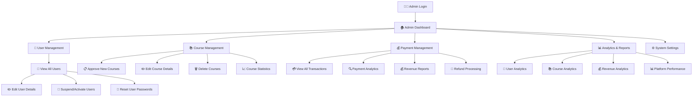

---

## 👨‍🏫 Teacher Management Flow

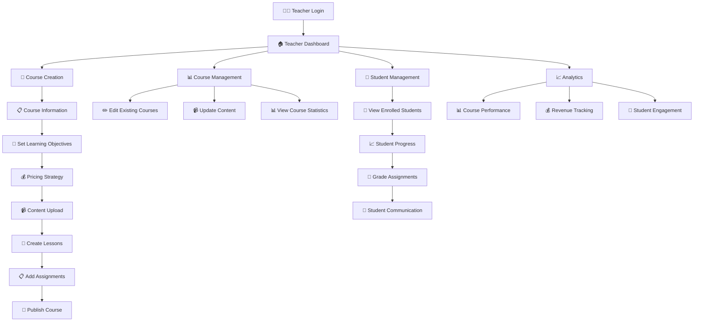

---

## 🗄️ Database Architecture

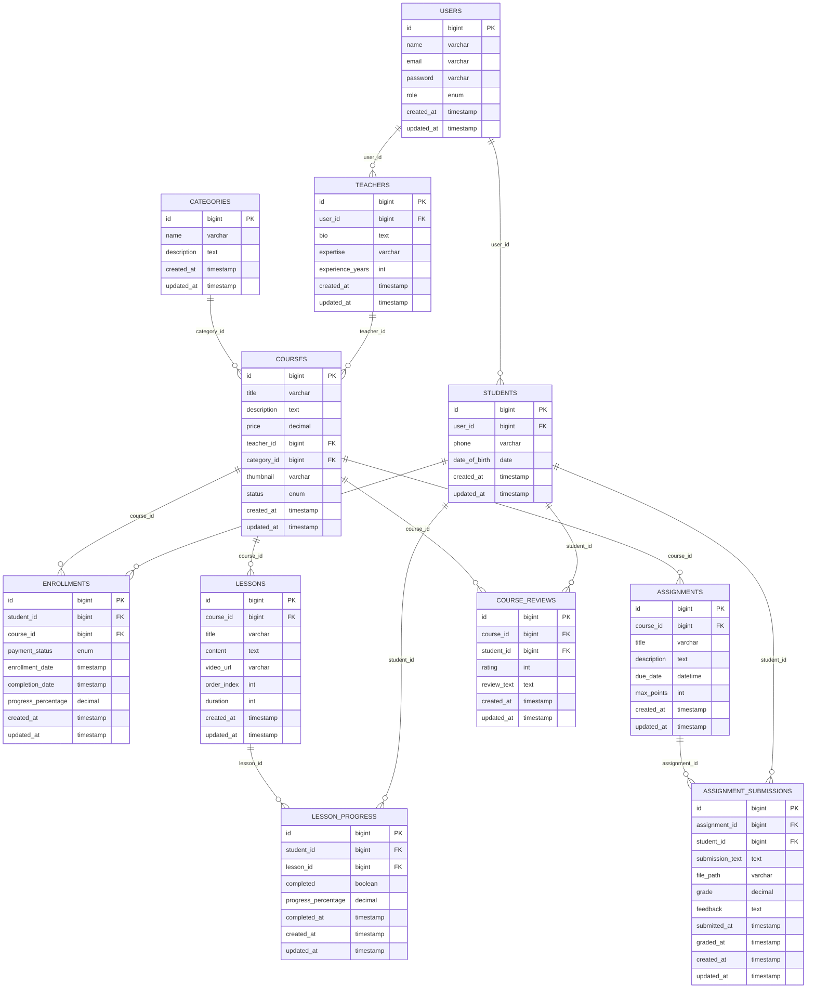

---

## 🔧 System Components

### Frontend Components
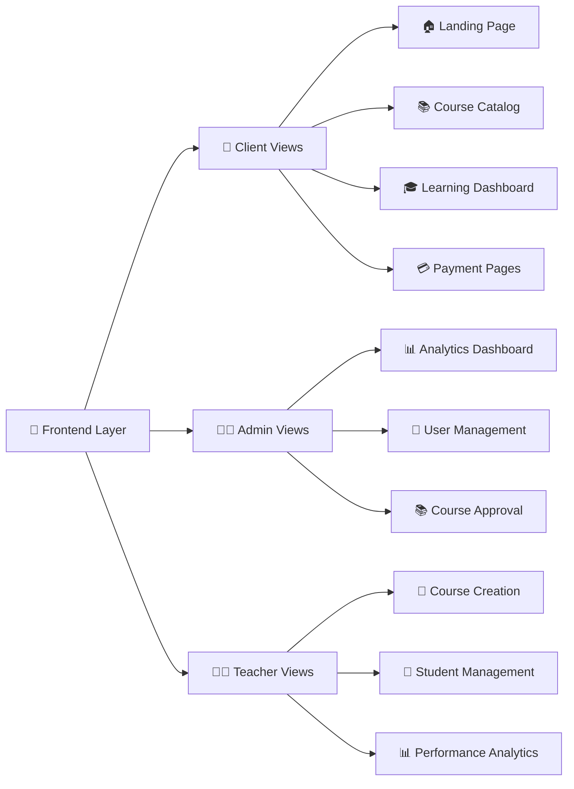

### Backend Components
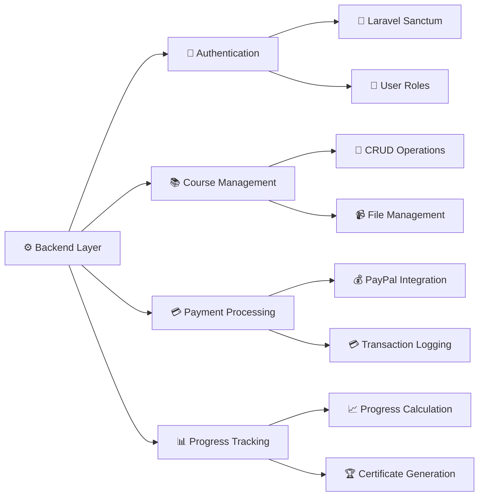

### Infrastructure
```mermaid
flowchart TD
    A[🏗️ Infrastructure] --> B[🖥️ Web Server]
    A --> C[🗄️ Database]
    A --> D[📁 File Storage]
    A --> E[📧 Email Service]
    
    B --> F[🔥 Laravel Framework]
    B --> G[🎨 Bootstrap + Tailwind]
    B --> H[⚡ Alpine.js]
    
    C --> I[🐬 MySQL Database]
    C --> J[🗃️ Migrations & Seeders]
    
    D --> K[📂 Local Storage]
    D --> L[☁️ Cloud Storage (Optional)]
    
    E --> M[📮 SMTP Configuration]
    E --> N[📧 Email Templates]
```

---

## 🚀 Deployment Flow

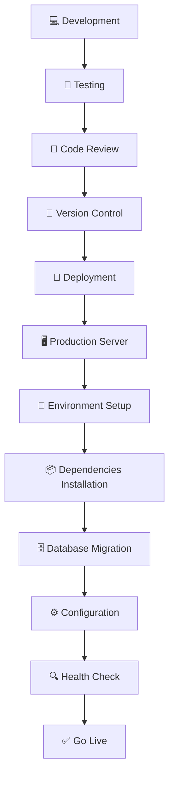

---

## 🔐 Security Flow

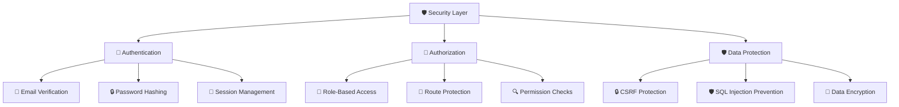

---

## 📱 Responsive Design Flow

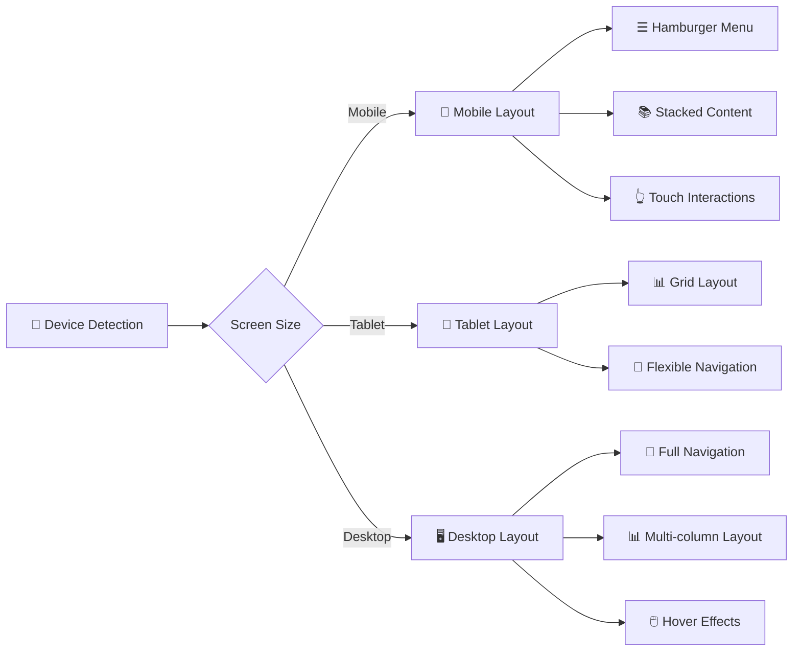

---

## 🎯 Key Features Summary

### ✅ Completed Features
- 🔐 **User Authentication System** (Login, Registration, Email Verification)
- 👥 **Multi-Role System** (Student, Teacher, Admin)
- 📚 **Course Management** (Create, Edit, Delete, Categorize)
- 💳 **PayPal Payment Integration** (Secure payment processing)
- 🎓 **Learning Progress Tracking** (Lesson completion, progress bars)
- 📝 **Assignment System** (Create, Submit, Grade)
- 📊 **Analytics Dashboard** (Course stats, user engagement)
- 🏆 **Certificate Generation** (Upon course completion)
- 📧 **Email Notifications** (Payment confirmations, course updates)
- 📱 **Responsive Design** (Mobile, tablet, desktop)
- ⚡ **Loading System** (Professional loading states)
- 🎨 **Modern UI/UX** (Glassmorphism, animations)

### 🔄 System Workflow Summary
1. **User Registration** → Email Verification → Role Assignment
2. **Course Creation** → Content Upload → Pricing → Publishing
3. **Course Enrollment** → Payment Processing → Access Granted
4. **Learning Journey** → Progress Tracking → Completion → Certificate
5. **Admin Oversight** → User Management → Course Approval → Analytics

---

*This flowchart represents the complete system architecture and user journey for the LearnHub Online Course Platform. Each component is designed to provide a seamless, secure, and engaging learning experience.*