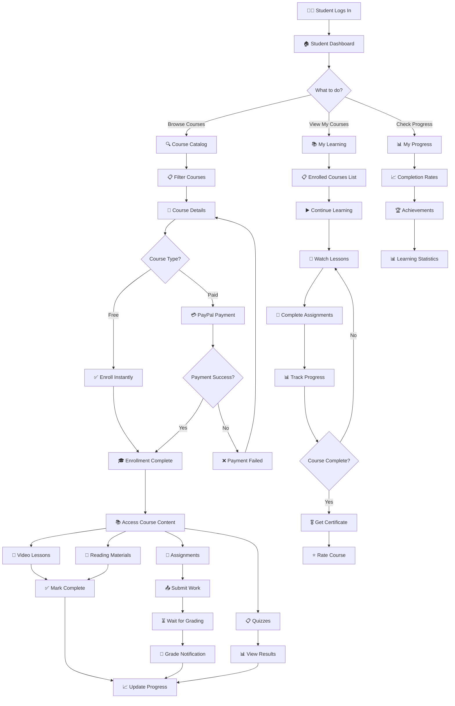
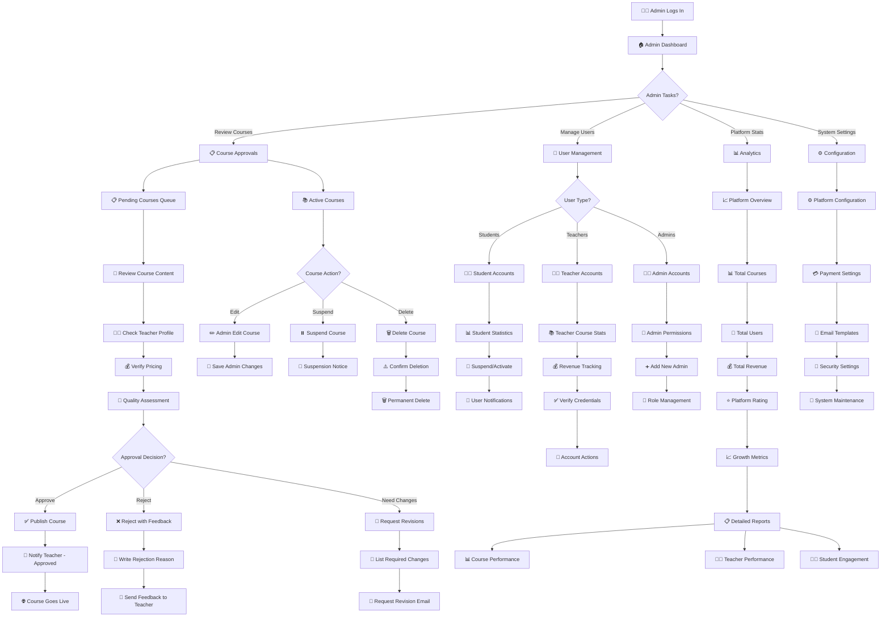
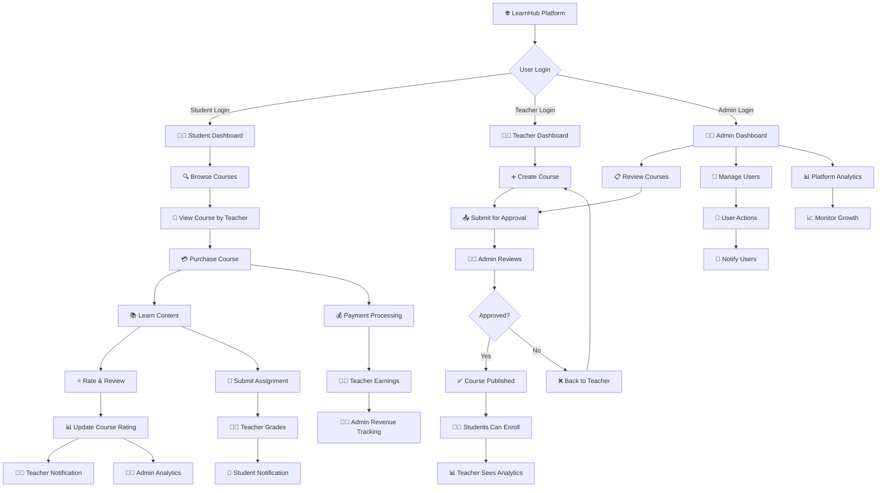

# 👥 LearnHub User Roles - Simplified Flowcharts

## 🎯 **Three Main User Roles Overview**

This document provides clear, focused flowcharts for each user role in your LearnHub platform.

---

## 👨‍🎓 **1. STUDENT Journey Flowchart**



---

## 👨‍🏫 **2. TEACHER Journey Flowchart**

```mermaid
graph TD
    A[👨‍🏫 Teacher Logs In] --> B[🏠 Teacher Dashboard]
    
    B --> C{What to do?}
    C -->|Create Course| D[➕ New Course]
    C -->|Manage Courses| E[📚 My Courses]
    C -->|View Students| F[👥 Student Management]
    C -->|Check Earnings| G[💰 Revenue Analytics]
    
    %% Create Course Path
    D --> H[📝 Course Information]
    H --> I[Course Title & Description]
    I --> J[💰 Set Price (Free/Paid)]
    J --> K[📂 Select Category]
    K --> L[🖼️ Upload Thumbnail]
    L --> M[📚 Add Course Content]
    
    M --> N[➕ Create Lessons]
    N --> O{Content Type?}
    O -->|Video| P[🎥 Upload Video]
    O -->|Text| Q[📄 Write Content]
    O -->|Assignment| R[📝 Create Assignment]
    O -->|Quiz| S[❓ Build Quiz]
    
    P --> T[💾 Save Lesson]
    Q --> T
    R --> U[📋 Set Due Date & Points]
    U --> T
    S --> V[📊 Set Questions & Answers]
    V --> T
    
    T --> W{Add More Content?}
    W -->|Yes| N
    W -->|No| X[📤 Submit for Review]
    X --> Y[⏳ Wait for Admin Approval]
    Y --> Z{Admin Decision?}
    Z -->|Approved| AA[✅ Course Published]
    Z -->|Rejected| BB[❌ Needs Revision]
    BB --> M
    
    %% Manage Courses Path
    E --> CC[📋 Course List]
    CC --> DD{Course Action?}
    DD -->|Edit| EE[✏️ Edit Course]
    DD -->|View Stats| FF[📊 Course Analytics]
    DD -->|Manage Content| GG[📚 Content Manager]
    
    EE --> HH[📝 Update Information]
    HH --> II[💾 Save Changes]
    
    FF --> JJ[📈 Enrollment Numbers]
    JJ --> KK[⭐ Student Ratings]
    KK --> LL[💰 Revenue Data]
    
    GG --> MM[➕ Add New Lessons]
    GG --> NN[✏️ Edit Existing]
    GG --> OO[🗑️ Delete Content]
    
    %% Student Management Path
    F --> PP[👥 Enrolled Students]
    PP --> QQ[📊 Student Progress]
    QQ --> RR[📝 Grade Assignments]
    RR --> SS[💬 Provide Feedback]
    SS --> TT[📧 Send Notifications]
    
    %% Revenue Path
    G --> UU[💰 Total Earnings]
    UU --> VV[📊 Payment History]
    VV --> WW[📈 Monthly Reports]
```

---

## 👨‍💼 **3. ADMIN Journey Flowchart**



---

## 🔄 **4. Role Interaction Flowchart**



---

## 🎯 **Role Permissions Summary**

### 👨‍🎓 **STUDENT Can:**
- ✅ Browse and search courses
- ✅ Enroll in free courses instantly
- ✅ Purchase paid courses via PayPal
- ✅ Access enrolled course content
- ✅ Track learning progress
- ✅ Submit assignments and take quizzes
- ✅ Rate and review completed courses
- ✅ View certificates and achievements

### 👨‍🏫 **TEACHER Can:**
- ✅ Create and edit courses
- ✅ Upload content (videos, documents, assignments)
- ✅ Set course pricing (free or paid)
- ✅ Manage enrolled students
- ✅ Grade assignments and provide feedback
- ✅ View course analytics and earnings
- ✅ Communicate with students
- ❌ Cannot approve own courses (needs admin)

### 👨‍💼 **ADMIN Can:**
- ✅ Review and approve/reject courses
- ✅ Manage all users (students, teachers, admins)
- ✅ Access platform-wide analytics
- ✅ Configure system settings
- ✅ Suspend or delete courses/accounts
- ✅ Monitor payments and revenue
- ✅ Send platform-wide notifications
- ✅ Full system control and oversight

---

## 📊 **User Workflow Statistics**

- **👨‍🎓 Student Journey**: 8 main steps from registration to certification
- **👨‍🏫 Teacher Journey**: 12 main steps from course creation to earnings
- **👨‍💼 Admin Journey**: 15 main oversight and management functions
- **🔄 Role Interactions**: 10+ cross-role communication points

**🎯 Each role has distinct responsibilities that work together to create a comprehensive online learning ecosystem!**